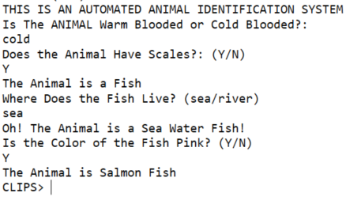
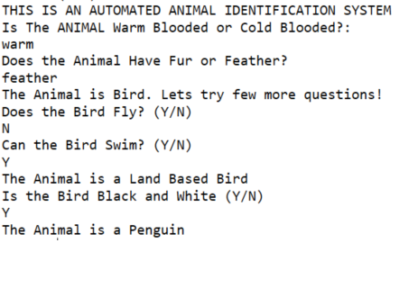
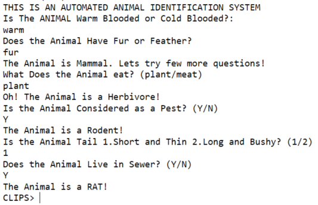
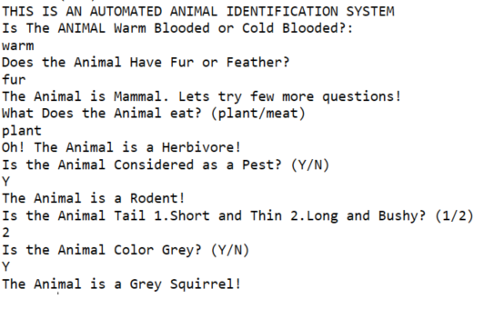
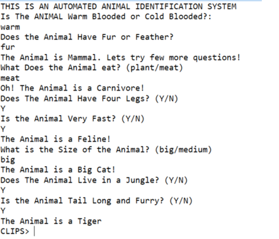
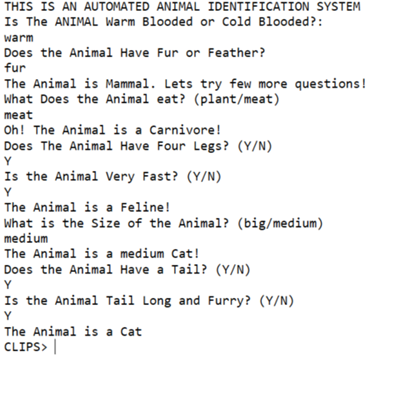

# AI Animal Identification System usingn CLIPS
The rules of the system were designed to illustrate how to represent various types of knowledge, rather than to provide accurate identification.

# <h1> Sample Questions and Answers deriving multiple differnt outputs
# <h1> 1)

# <h1> 2)

# <h1> 3)

# <h1> 4)

# <h1> 5)

# <h1> 6)

  
